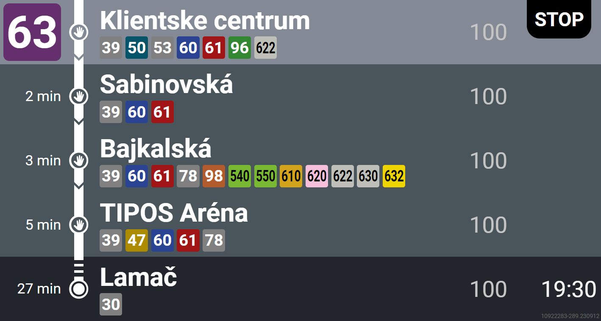

# Oznamovník

Napodobenina hlásiča Bratislavských zastávok. Zobrazuje a hlási zastávky v reálnom čase podľa cestovného poriadku. Work in progress :)

## Zoznam zastávok

Zoznam zastávok v súbore `stops.json` bol získaný z [GTFS dát](https://data.bratislava.sk/pages/gtfs_navod), presnejšie z `stops.txt`. Tento súbor ale neobsahuje názvy zastávok v podobe, ako ich povie text-to-speech. Preto boli manuálne prepísané názvy zastávok tak, aby boli čo najviac podobné tým, ktoré hovorí hlásenie. 
Ale nepoznám všetky hlásenia, v prípade potreby korekcie pošlite pull request súboru `stops.json` a hlásenia pregenerujem.


## Vytvorenie nových hlásení

Slovenské hlásenia dopravný podnik vytvára pomocou modelu `sk-SK-ViktoriaNeural`, ktorý je dostupný aj v online z Microsoft Edge-u.

Vygenerujte si vlastné hlásenie nasledovne (vyžaduje nainštalovaný `python3` a `python3-pip`):

```bash
pip install edge-tts
edge-tts --voice "sk-SK-ViktoriaNeural" --text "Americké námestie" --write-media americke.mp3
```

## Webové rozhranie

Webové rozhranie zobrazuje hlásenia v reálnom čase na štýl obrazovky "BUSE".


### Nahratie cestovných poriadkov

K webovému rozhraniu nie sú pribalené cestovné poriadky. Pre ich pridanie do zložky `frontend/static/gtfs` rozbaľte obsah zip súboru GTFS dát, ktorý si môžete stiahnuť z [online adresy](https://www.arcgis.com/sharing/rest/content/items/aba12fd2cbac4843bc7406151bc66106/data). Tieto dáta sú aktualizované niekoľko krát do mesiaca, pre ich aktualizáciu stačí znova  prepísať `.txt` súbory v rovnakej zložke.


### Spustenie webového rozhrania

Pre spustenie webového rozhrania (pre vývoj) je potrebné mať nainštalovaný `nodejs`, odporúčaná verzia je 18.17.1 a vyššia.

```bash
cd frontend
npm install
npm run dev
```


## TODO

- [x] pridanie hlásení zastávok
- [ ] pridanie extra hlásení
- [ ] nájdenie rovnakého anglického text-to-speech modelu, ktorý používa Dopravný podnik
- [X] webové rozhranie na štýl obrazovky "BUSE"
- [ ] pridanie hlásení do webového rozhrania


## Licencia

GPL-3.0
